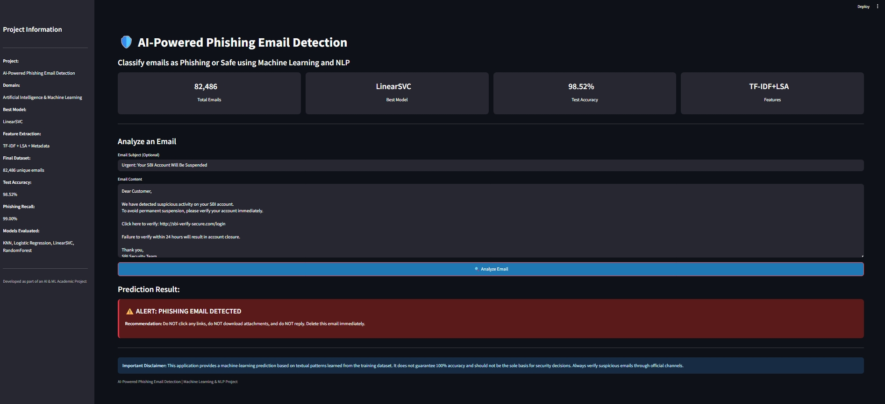
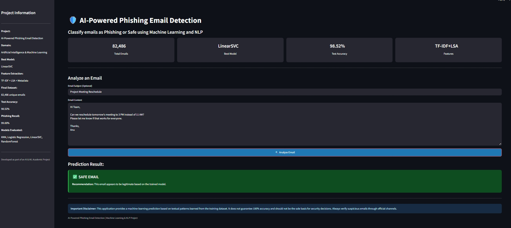

# 🛡️ AI-Powered Phishing Email Detection

An ML-powered web application to classify emails as **Phishing** or **Safe** in real-time using Natural Language Processing and Machine Learning.

## **Project Overview**
Phishing attacks are a major cybersecurity threat. This project uses a LinearSVC model trained on 82,486 emails to detect malicious phishing emails with 98.52% accuracy. The app provides an instant, user-friendly interface to analyze any email content.

## **Key Features**
- **Real-time Prediction**: Get instant "Safe" or "Phishing" results
- **High Accuracy**: 98.52% Test Accuracy with 99.00% Phishing Recall
- **Advanced NLP**: Uses TF-IDF + LSA Embeddings + Metadata Features
- **Professional UI**: Clean Streamlit interface with project dashboard

## **Tech Stack**
`Python` | `Scikit-learn` | `Pandas` | `NumPy` | `Streamlit` | `NLP`

## **Models Evaluated**
`KNN` | `Logistic Regression` | `LinearSVC` | `Random Forest`
**Best Model:** `LinearSVC`

## **How to Run Locally**
1.  Clone the repository
    ```bash
    git clone https://github.com/Anugjna/AI-Powered-Phishing-Email-Detection/
## 🔗 Live Demo
[Click here to try the app]([https://ai-powered-phishing-email-detector-anugjna.streamlit.app/)]
## 📸 Screenshots

### Phishing Email Detected


### Safe Email Detected  

